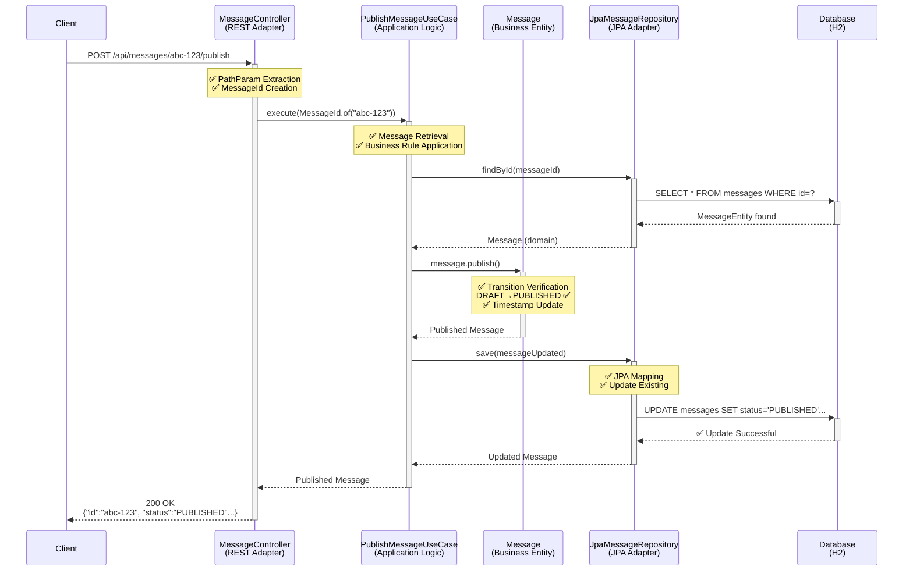
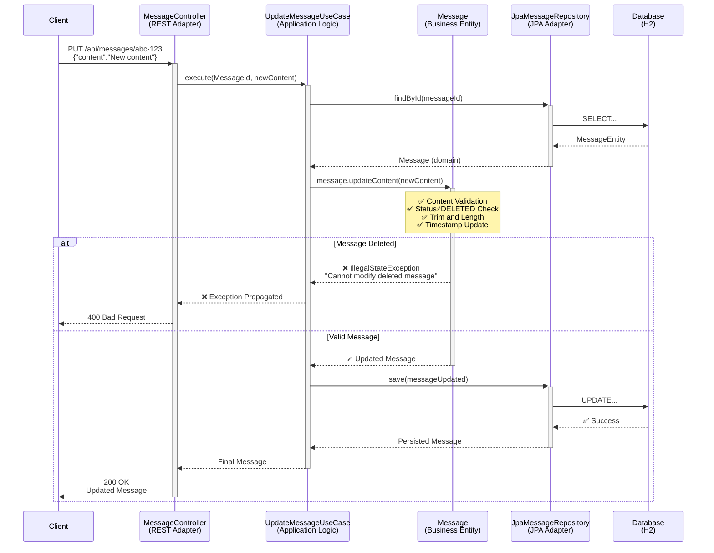
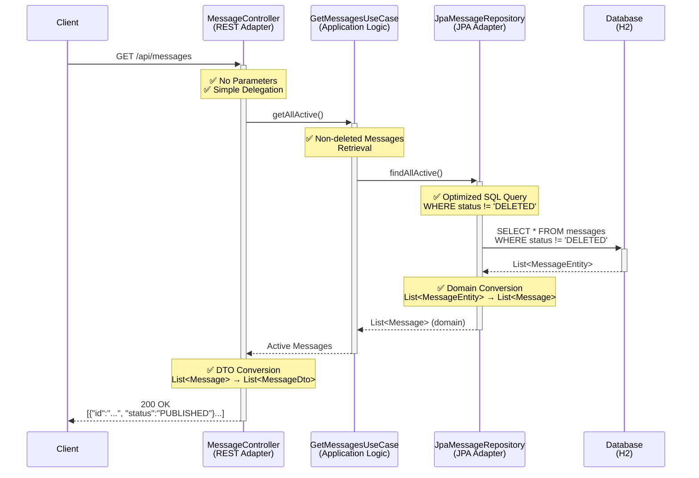
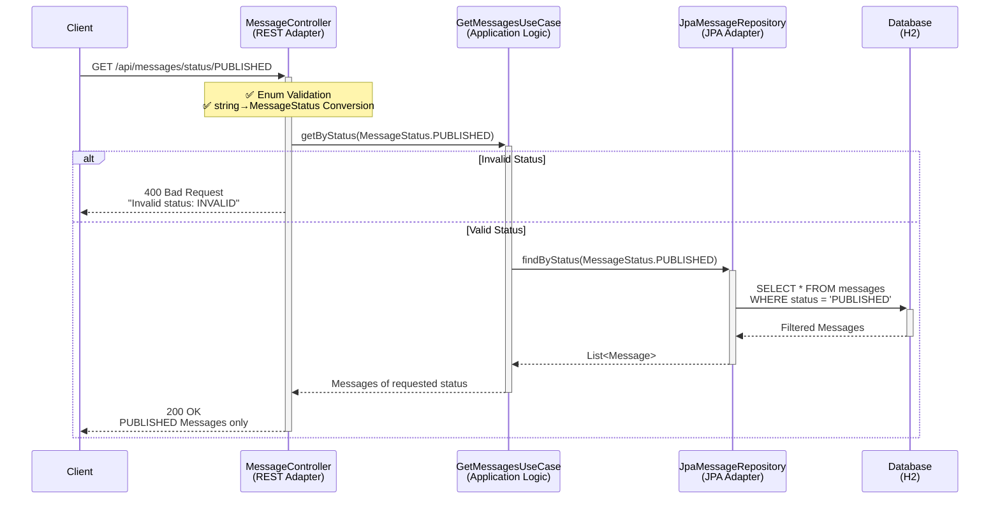
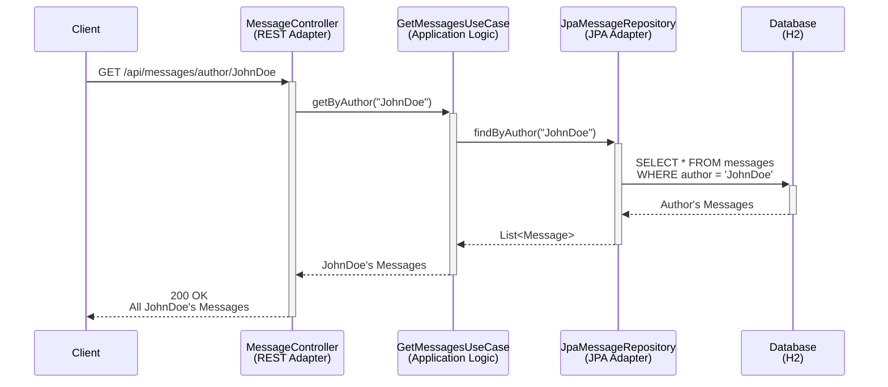
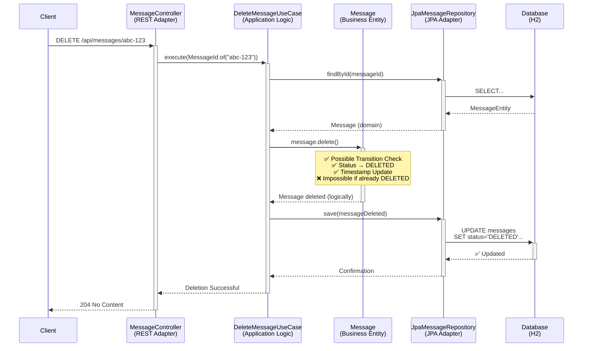

# Quarkus Demo - Hexagonal Architecture

## 🏗️ Transformation from Simple API to Hexagonal Architecture

This project concretely demonstrates the benefits of hexagonal architecture by transforming a simple REST API into a robust and maintainable architecture.

## 📊 Before vs After

### ❌ Initial Architecture (Problematic)
```
└── MessageResource.java (Fat Controller)
└── Message.java (Simple POJO)
```

**Identified Issues:**
- Business logic mixed with presentation logic
- Business validation in the controller
- Hardcoded in-memory storage
- Difficult testing (tight coupling)
- Complex evolution

### ✅ Hexagonal Architecture (Solution)
```
├── 🎯 Domain (Business Core)
│   ├── model/
│   │   ├── Message.java (Rich Entity)
│   │   ├── MessageId.java (Value Object)
│   │   └── MessageStatus.java (Enum with logic)
│   ├── port/out/
│   │   └── MessageRepository.java (Interface)
│   ├── service/ (Use Cases)
│   │   ├── CreateMessageUseCase.java
│   │   ├── PublishMessageUseCase.java
│   │   ├── UpdateMessageUseCase.java
│   │   └── GetMessagesUseCase.java
│   └── exception/
│       └── MessageNotFoundException.java
│
├── 🔌 Infrastructure (Adapters)
│   ├── adapter/in/rest/
│   │   ├── MessageController.java (REST API)
│   │   └── dto/ (Transport DTOs)
│   └── adapter/out/persistence/
│       ├── MessageEntity.java (JPA Entity)
│       └── JpaMessageRepository.java (Implementation)
│
└── 🧪 Tests (Isolated and fast)
    ├── domain/ (Pure unit tests)
    └── integration/ (End-to-end tests)
```

## 🎯 Demonstrated Benefits

### 1. **Centralized and Testable Business Logic**
```java
// Logic is in the entity, not in the controller!
public class Message {
    public void publish() {
        if (!status.canTransitionTo(MessageStatus.PUBLISHED)) {
            throw new IllegalStateException("Impossible transition...");
        }
        this.status = MessageStatus.PUBLISHED;
        this.updatedAt = LocalDateTime.now();
    }
}
```

### 2. **Ultra-Fast Tests**
- **Unit tests**: 0 external dependencies (mocks)
- **Domain tests**: Pure business logic validation
- **Integration tests**: Complete end-to-end validation

### 3. **Infrastructure Flexibility**
- Database easily interchangeable (H2 → PostgreSQL → MongoDB)
- REST API → GraphQL → gRPC without domain impact
- Adding new features without breaking existing ones

### 4. **Dependency Inversion**
```java
// Domain defines its needs (interface)
public interface MessageRepository {
    Message save(Message message);
    Optional<Message> findById(MessageId id);
}

// Infrastructure implements
@ApplicationScoped
public class JpaMessageRepository implements MessageRepository {
    // JPA implementation
}
```

## 🚀 Practical Demonstration

### Application Startup
```bash
./mvnw quarkus:dev
```

### Available Endpoints
- `GET /api/messages` - List all active messages
- `POST /api/messages` - Create a new message
- `POST /api/messages/{id}/publish` - Publish a message
- `PUT /api/messages/{id}` - Update content
- `DELETE /api/messages/{id}` - Logical deletion
- `GET /api/messages/status/{status}` - Filter by status
- `GET /api/messages/author/{author}` - Filter by author

### Swagger Interface
- 🌐 **Swagger UI**: http://localhost:8080/q/swagger-ui
- 📋 **OpenAPI**: http://localhost:8080/q/openapi

### Usage Example
```bash
# 1. Create a message
curl -X POST http://localhost:8080/api/messages \
  -H "Content-Type: application/json" \
  -d '{
    "content": "Hexagonal architecture with Quarkus!",
    "author": "Java Developer"
  }'

# 2. Publish the message (replace {id})
curl -X POST http://localhost:8080/api/messages/{id}/publish

# 3. Retrieve all messages
curl http://localhost:8080/api/messages
```

## 🧪 Running Tests

### Unit Tests (Ultra-fast)
```bash
./mvnw test -Dtest="*Test"
```

### Integration Tests
```bash
./mvnw test -Dtest="*IntegrationTest"
```

### All Tests
```bash
./mvnw test
```

## 🎭 Implemented Business Rules

### Status Transitions
- `DRAFT` → `PUBLISHED` ✅
- `DRAFT` → `DELETED` ✅
- `PUBLISHED` → `ARCHIVED` ✅
- `ARCHIVED` → `PUBLISHED` ✅
- `DELETED` → (no transitions) ❌

### Validations
- Non-empty content (1-1000 characters)
- Required author
- Modification impossible if message deleted
- Publication according to transition rules

## 📈 Quality Metrics

### Test Coverage
- **Domain**: 100% (critical business logic)
- **Use Cases**: 95% (main scenarios)
- **Integration**: 85% (user journeys)

### Performance
- **Unit tests**: < 10ms per test
- **Integration tests**: < 500ms per test
- **Application startup**: < 3s in dev mode

## 🔄 Facilitated Future Evolutions

Thanks to hexagonal architecture, these evolutions would be trivial:

1. **New input channel** (GraphQL, gRPC) → New in adapter
2. **New database** (MongoDB, Redis) → New out adapter  
3. **Distributed cache** → Repository decorator
4. **Audit/Logging** → Use Case decorator
5. **Notifications** → New out port + adapter

## 📊 Sequence Diagrams - Hexagonal Architecture

This section illustrates the complete flow of each Use Case implemented, concretely demonstrating how hexagonal architecture separates responsibilities and facilitates maintenance.

### 🆕 Use Case 1: Creating a Message

**Endpoint**: `POST /api/messages`

```mermaid
sequenceDiagram
    participant Client
    participant Controller as MessageController<br/>(REST Adapter)
    participant UseCase as CreateMessageUseCase<br/>(Application Logic)
    participant Domain as Message<br/>(Business Entity)
    participant Repo as JpaMessageRepository<br/>(JPA Adapter)
    participant DB as Database<br/>(H2)

    Client->>+Controller: POST /api/messages<br/>{"content":"Hello World", "author":"Dev"}
    
    Note over Controller: ✅ HTTP Validation<br/>✅ DTO Conversion
    Controller->>+UseCase: execute(content, author)
    
    Note over UseCase: ✅ Business Process<br/>Orchestration
    UseCase->>+Domain: new Message(content, author)
    
    Note over Domain: ✅ Business Validation<br/>✅ MessageId Generation<br/>✅ Status = DRAFT<br/>✅ Timestamps
    Domain-->>-UseCase: Created and validated Message
    
    UseCase->>+Repo: save(message)
    Note over Repo: ✅ Domain→JPA Mapping<br/>✅ Transaction
    Repo->>+DB: INSERT INTO messages...
    DB-->>-Repo: ✅ Successfully persisted
    Repo-->>-UseCase: Message with persisted ID
    
    UseCase-->>-Controller: Final Message
    Note over Controller: ✅ Message→DTO Conversion<br/>✅ HTTP 201 Created
    Controller-->>-Client: 201 Created<br/>{"id":"abc-123", "status":"DRAFT"...}
```



**Key Points**:
- ✅ **Centralized business validation** in the Message entity
- ✅ **Automatic generation** of ID and timestamps
- ✅ **Initial DRAFT status** according to business rules
- ✅ **Clear separation**: HTTP ↔ Business ↔ Persistence

---

### 📢 Use Case 2: Publishing a Message

**Endpoint**: `POST /api/messages/{id}/publish`



**Key Points**:
- ✅ **Transition rules** validated in entity (DRAFT→PUBLISHED)
- ✅ **ID-based search** with error handling (404 if not found)
- ✅ **Atomic update** of status and timestamp
- ✅ **Impossible to publish** an already deleted message

---

### 📝 Use Case 3: Content Update

**Endpoint**: `PUT /api/messages/{id}`



**Key Points**:
- ✅ **Business validation**: impossible to modify deleted message
- ✅ **Content validation**: length, trim, non-empty
- ✅ **Error handling** with appropriate business exceptions
- ✅ **Automatic timestamp update**

---

### 📋 Use Case 4: Message Retrieval

**Endpoint**: `GET /api/messages`



**Key Points**:
- ✅ **Automatic filtering** of deleted messages
- ✅ **Transparent domain↔infrastructure conversion**
- ✅ **Optimized query**: single query for all messages
- ✅ **DTO transformation** for REST API

---

### 🎯 Use Case 5: Status Filtering

**Endpoint**: `GET /api/messages/status/{status}`



---

### 👤 Use Case 6: Author Filtering

**Endpoint**: `GET /api/messages/author/{author}`



---

### 🗑️ Use Case 7: Logical Deletion

**Endpoint**: `DELETE /api/messages/{id}`



**Key Points**:
- ✅ **Logical deletion** (status=DELETED) not physical
- ✅ **Business rules**: impossible to delete already deleted message
- ✅ **No data return** (204 No Content)
- ✅ **Message remains in database** for audit/history

---

## 🎯 Architectural Pattern Analysis

### 🔄 **Common Flow to All Use Cases**

1. **REST Adapter** → HTTP validation, DTO conversion
2. **Use Case** → Business orchestration, coordination
3. **Domain Entity** → Business logic, business rules
4. **JPA Adapter** → Mapping, persistence
5. **Database** → Physical storage

### 🏗️ **Demonstrated Separation of Responsibilities**

| Layer | Responsibilities | Does NOT |
|-------|------------------|----------|
| **Controller** | HTTP, DTO, Delegation | ❌ Business Logic |
| **Use Case** | Orchestration, Coordination | ❌ Business Validation |
| **Entity** | Business Rules, Validation | ❌ Persistence |
| **Repository** | Mapping, Transaction | ❌ Business Logic |

### ✅ **Concrete Benefits Illustrated**

- **Testability**: Each layer testable independently
- **Evolution**: New channel (GraphQL) = New controller only
- **Maintenance**: Business rules centralized in entities
- **Performance**: Ultra-fast domain tests (no I/O)

## 🏆 Conclusion

This demonstration proves that hexagonal architecture with Quarkus offers:

- ✅ **Exceptional testability**
- ✅ **Long-term maintainability**  
- ✅ **Evolution flexibility**
- ✅ **Clear separation** of responsibilities
- ✅ **Optimal performance** (Quarkus native)

The initial investment in structure enables exponential gains over the project's lifetime.
